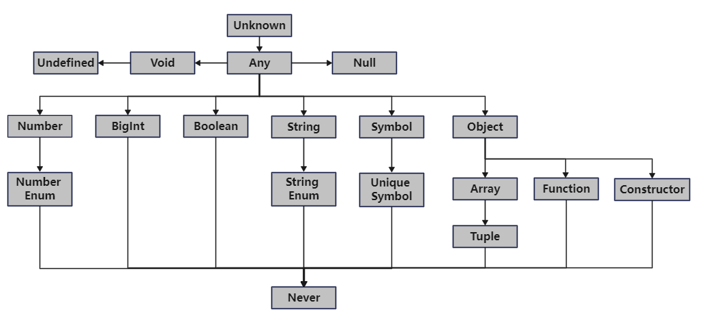

### 1 关于本书

#### 1.1 作者

Boris Cherny就职于Facebook，是工程和产品部门主管。他曾在风投公司、广告技术公司和一些初创公司工作。他喜欢研究编程语言、代码合成和静态分析，乐于构建让人钟爱的用户体验。

#### 1.2 出版社

英文版出版社: O'Reilly
中文版出版社: 中国电力出版社 （2020年6月第一版）

#### 1.3 我为什么读这本书

以下几点原因，促使我决定认真学习下TypeScript：

- 今年参与开发一款H5游戏，基于Laya引擎，使用TypeScript语言。当时对TypeScript掌握并不深入，只是简单了解TypeScript的基本语法。

- 最近在学习腾讯的开源项目：Puerts，该项目是在Unity中启动一个JavaScript引擎，以支持使用TypeScript编写游戏逻辑。这个思路与腾讯之前开源的XLua类似，不过TypeScript比Lua对大型项目更加友好。

- 大学期间，使用反人类的MFC编写应用程序的界面非常痛苦。当时我想，是否有一种技术可以像网页那样使用html、css和JavaScript制作桌面应用。随着H5、NodeJS、Electron等技术的发展，这个想法已经可以实现了，当然这些都离不开JavaScript。

O'Reilly出版的技术书籍向来有口皆碑，所以第一本TypeScript书就选了这本《TypeScript编程》。

#### 1.4 我读完什么感受

- 考虑到中国出版社给译者的报酬，这本书的中文翻译还算过得去，至少读的时候不会直接扔掉去买英文版。

- 这本书不太适合初学者，作者并没有介绍TypeScript的基本语法，所以读者最好具有JavaScript的经验。另外，了解C++、Java或C#等传统面向对象语言对阅读本书会有帮助，因为TypeScript借鉴了很多C#的设计（毕竟都是出自微软）。

- 整个阅读过程都在惊叹TypeScript的各种奇淫技巧（其中很多是继承自JavaScript）。然而，作者在介绍这些特性的同时并没有相应地介绍其推荐用法，所以我又购买了一本O'Reilly出版的《Effective TypeScript》。

### 2 TypeScript的特点

#### 2.1 始于JavaScript，终于JavaScript

TypeScript的代码可以编译出纯净的JavaScript代码，并可以运行于各种浏览器、NodeJS等JavaScript引擎。

#### 2.2 强大的类型系统

TypeScript的强类型系统可以进行静态类型检查，从而尽可能的将错误从运行时提前到编译时。同时，TypeScript对于面向对象的支持，使其更适合大型项目。

例如，对于下面这个函数，TypeScript会在编译时报错。而JavaScript则认为这是一个正常情况，并且在运行时也不报错，而是返回NaN。

```
function f(a) {
    return a / 2;
}
f("z");
```

#### 2.3 先进的JavaScript

TypeScript提供最新的JavaScript特性，包括最新的ECMAScript标准以及未来提案中的特性。

### 3 创建TypeScript项目

#### 3.1 TypeScript编译器

在创建项目前，先了解下TypeScript的编译器TSC。

编译时，TSC先根据TypeScript代码生成抽象语法书(AST)，再基于AST做类型检查，然后将AST转换为JavaScript代码。最后，像以往一样将其交给JavaScript引擎运行。

JavaScript引擎是一个集成了JavaScript编译器和运行时的程序，常见的有：

- V8：Chrome、Opera、NodeJS使用
- SpiderMonkey：Firefox使用
- JSCore：Safari使用
- Chakra：Edge使用

需要记住一点，TSC在将TypeScript编译成JavaScript时，会丢弃TypeScript中的类型信息。所以，TypeScript引入的类型系统只是影响了程序员写代码的方式，使其更容易写出安全的JavaScript代码。更直白一点，微软觉得JavaScript太灵活了，程序员很难在大型项目中驾驭这门语言，所以创造了更安全的TypeScript。

#### 3.2 创建工程

我们使用npm安装TypeScript，然后使用NodeJS执行JavaScript代码。先确保电脑上已经安装NodeJS和npm（安装NodeJS时会自动安装npm）：

```shell
node -v
v16.13.0

npm -v
8.1.0
```

然后，创建一个新文件夹ts，将其初始化为npm项目并安装TypeScript、TSLint：

```shell
mkdir ts
cd ts

# 初始化一个npm项目
npm init

# 安装TSC、TSLint和NodeJS的类型声明
npm install --save-dev typescript tslint @types/node
```

其中，tslint是TypeScript的代码格式分析工具，@type/node是NodeJS的类型声明。因为TypeScript是强类型语言，所以使用NodeJS的api时需要知道其类型声明，就像C++中使用第三方库时需要引入其头文件一样。

#### 3.3 tsconfig.json

因为TSC编译器有很多选项（一百多个？），在命令行指定这些编译选项太麻烦，所以将其配置在文件tsconfig.json中，TSC命令默认会读取该文件。

```json
{
    "compilerOptions": {
        "lib": ["ES2015"],
        "module": "commonjs",
        "target": "ES2015",
        "strict": true,
        "outDir": "dist",
        "sourceMap": true
    },
    "include": [
        "src"
    ]
}
```

其中：
- lib：指定代码的运行环境中有哪些api，因为JavaScript可能运行在浏览器环境中，也可能运行在NodeJS这样的非浏览器环境中。
- module：使用哪个模块系统（CommonJS、SystemJS、ES2015等）。
- target：将代码编译为JavaScript的哪个版本（ES3、ES5、ES2015等）。
- strict：按照严格的规则检查代码语法。我始终设置为true，以更好的利用TypeScript的类型系统发现错误。

#### 3.4 tslint.json

```shell
./node_modules/.bin/tslint --init
```

该命令生成tslint.json文件，可以在其中配置自己的代码格式。

```json
{
    "defaultSeverity": "error",
    "extends": [
        "tslint:recommended"
    ],
    "jsRules": {},
    "rules": {
        "semicolon": true,
        "trailing-comma": false
    },
    "rulesDirectory": []
}
```

然后，执行tslint命令进行检查：

```shell
./node_modules/.bin/tslint --project .
```

现代编译器基本都集成了代码格式检查功能，比如VSCode可以安装TSLint插件实时检查（无须执行tslint命令）。[这里](https://palantir.github.io/tslint/rules/)是TSLint的文档。

#### 3.5 创建TypeScript文件

最后，创建TypeScript代码文件index.ts。

```shell
mkdir src
touch src/index.ts
```

目前，项目的目录结构如下：

```
ts/
|--node_modules/
|--src/
|    |--index.ts
|--package.json
|--tsconfig.json
|--tslint.json
```

打开src/index.ts，输入以下代码：

```typescript
console.log("Hello TypeScript!");
```

然后编译、运行:

```shell
# 使用TSC编译TypeScript
./node_module/.bin/tsc

# 使用NodeJS执行JavaScript
node ./dist/index.js
```

此时控制台会输出一行日志：

```
Hello TypeScript!
```

每次输入编译、执行命令太烦，可以将其配置在package.json中，使用npm执行。修改package.json文件，添加两个script：

```json
  "scripts": {
    "build": "./node_modules/.bin/tsc",
    "start": "node ./dist/main.js"
  }
```

然后通过npm命令来执行这两条指令：

```shell
npm run build
npm run start
```

至此，我们创建了一个最简单的TypeScript项目，下面进入TypeScript语言本身的内容。

### 4 TypeScript类型

因为TypeScript相对于JavaScript最大的特点是增加了强类型系统，所以作者先介绍类型。类型是指一系列值及可以对其执行的操作，TypeScript中的类型结构如下图：



#### 4.1 null类型

在其他语言里，null是值，可以赋值给任何类型的对象。但是在TypeScript中（编译选项strict为true时），null是一个类型，直接继承自any类型。null类型只有一个值，就是null。

在C++或者Java中，下面这段代码再正常不过：

```typescript
class Cat {
    public name: string = "Tom";
}

let cat: Cat = null;
```

但是在TypeScript中，这段代码有语法错误。因为null类型与Cat类型没有任何关系，所以无法将null类型的null值赋值给Cat类型的变量cat。这个问题有点儿严重，比如有一个函数getCat()返回一个Cat对象，但是在某些情况下返回是一个空值。然而，cat和null是不同的类型，一个函数如何返回这两种类型？

比如下面这段代码报错：Type 'null' is not assignable to type 'Cat'.

```
function getCat(): Cat {
    return null;
}
```

对于这个问题，TypeScript引入了类型的“并”，即集合的概念，下文会介绍。

#### 4.2 any类型
    
通常，TypeScript编译器可以根据上下文推导出变量的类型，比如下面这个语句，编译器认为变量a是number类型：

```typescript
let a = 2;
```

如果编译器无法推导出某个变量的类型，那么就认为是any类型。any类型的值就像常规的JavaScript一样，类型检查器完全发挥不了作用，所以应该**尽量避免使用**，除非万不得已。如果一定要用any类型，那么应该显式的声明变量的类型为any。

```typescript
let a: any;
```

作者的建议是如果编译器可以推导变量的类型，那么就无须显式的声明（除非是any类型）。但我的习惯是，**不管变量是什么类型，都应该显示声明**。这样做与编译器能否推导无关，主要是方便程序员阅读代码。另外，因为转换为JavaScript时会丢掉类型信息，所以这么做并不影响最终代码的执行（比如效率、文件大小等）。

#### 4.3 unknown类型

unknown类型代表比any类型更强烈的未知。在少数情况下，如果确实无法预知一个值的类型，那么应该使用unknown，而不是any。unknown类型的值可以进行比较（使用==、===、||、&&和?）、否定（使用!），可以使用JavaScript的typeof和instanceof运算符。TypeScript不会把任何值推导为unknown类型，所以如果要使用unknown必须显式声明。

如果要对unknown类型执行其他类型的操作，比如number类型的加法，那么必须向编译器证明其确实是number类型。比如下面这段代码会报错：

```typescript
let a: unknown = 2;
let b = a + 1;
```

而下面这段代码不会，因为在执行a+1运算之前已经向编译器证明了a是number类型：

```typescript
let a: unknown = 2;
if (typeof(a) === "number") {
    let b = a + 1;
}
```

读到这里的时候，我有一种怪怪的感觉，这TypeScript编译器挺智能啊。因为在大部分编程语言中，if语句的结果只有在运行时才知道，所以if语句对于后续代码语法的正确性没有影响。而在TypeScript中，编译器会尝试计算if语句的值，从而判断后续代码的语法是否正确。我又进行了一些测试，看看这编译器到底有多智能。

- 测试一：报错，无论temp === 0是否为true。

```typescript
let temp = 0;

let a: unknown = 2;
if (typeof(a) === "number" || temp === 0) {
    let b = a + 1;
}
```

- 测试二：不报错，无论temp === 0是否为true。测试二中将||改为&&，那么要执行a+1，就必须使typeof(a) === "number"为true，从而保证了变量a的类型为number。

```typescript
let temp = 0;

let a: unknown = 2;
if (typeof(a) === "number" && temp === 0) {
    let b = a + 1;
}
```

#### 4.4 字面量类型

字面量类型是指仅表示一个值的类型，在C++、Java等语言中不存在字面量类型。而在TypeScript中，下面这段代码是合法的，变量a是字面量类型，只能取一个值，即true。

```typescript
let a: true = true;
```

读到这里时，我同样有一种怪怪的感觉，但是没有之前强烈。因为已经见识过null是一种类型，其值只有一个，也叫null，所以也能理解true是一种类型，其值只有一个，也叫true了。唯一不太明白的是，引入字面量类型的意义是什么？为什么不直接将a定义为常量呢？

```typescript
const a: boolean = true;
```

作者没有解释这个问题，我也没明白。

**注意**，下面代码的第二行报语法错误：Type 'string' is not assignable to type '"Cat"'.

```typescript
let a = 'Cat';
let b: 'Cat' = a;
```

细想一下也容易理解，b是字面量类型：'Cat'，而a没有显式指定类型，编译器推导为string。正确的做法是将a也显式指定为'Cat'字面量类型。

```typescript
let a: 'Cat' = 'Cat';
let b: 'Cat' = a;
```

或者，将a声明为const：

```typescript
const a = 'Cat';
let b: 'Cat' = a;
```

对于const变量，TypeScript会收窄其类型，所以变量a是字面量类型'Cat'，而不是string。

但是，不太容易理解的是下面这段代码不报语法错误：

```typescript
let c = true;
let d: true = c;
```

其中变量c被推断为boolean类型，而d是字面量true类型，竟然不报错，有点儿诡异。为了避免这些细枝末节的麻烦，我还是决定在代码中使用常量或枚举代替字面量。

#### 4.5 结构化类型

TypeScript是结构化类型，而C++、Java是名义化类型。所谓结构化类型，就是只要两个类的属性相同，就认为他们是同一种类型。或者说，结构化类型重实质而轻形式。下面这段代码是合法的：

```typescript
class Cat {
    public name: string = "Cat";
}

class Bus {
    public name: string = "Bus";
}

let cat: Cat = new Bus();
console.log(cat.name);
```

猜测这个特性是从JavaScript继承的，因为JavaScript中的对象与json之间存在着先天的对应关系，所以当把json转换为JavaScript对象时，如果两个json的结构一致，就认为他们是同一类型。和字面量类型一样，我不会在项目中使用这个特性，毕竟把一个Bus类型的对象赋值给一个Cat类型的变量，肯定是代码设计上出了问题。

#### 4.6 集合的思想

一般来说，编程语言中的类型遵从树形的继承关系，TypeScript也不例外。同时，TypeScript还引入了类型的集合概念，比如下面这段代码是合法的：

```
class Cat {
    public name: string = "Cat";
    public age: number = 1;
}

class Bus {
    public name: string = "Bus";
    public speed: number = 100;
}

let cat: Cat | Bus = new Bus();
```

变量cat的类型是Cat | Bus，这是类型Cat与Bus的并集，代表cat可以是Cat类型，也可以是Bus类型，也可以即是Cat也是Bus类型（同时具有这两个类型的属性）。下面这段代码都是合法的：

```
class Cat {
    public name: string = "Cat";
    public age: number = 1;
}

class Bus {
    public name: string = "Bus";
    public speed: number = 100;
}

let v1: Cat | Bus = {
    name: "",
    age: 2
};

let v2: Cat | Bus = {
    name: "",
    speed: 20
};

let v3: Cat | Bus = {
    name: "",
    age: 2,
    speed: 20
};
```

如果变量既可以是Cat类型，也可以是Bus类型，那如何访问其属性呢？访问name还好，毕竟Cat和Bus都有，那访问age或speed呢？这个问题与前面的unknown类型情况类似，需明确告知编译器这个变量的类型。

下面这段代码有语法错误：

```typescript
let cat: Cat | Bus = new Bus();
console.log(cat.age);
```

而这段代码则没有问题：
```typescript
let cat: Cat | Bus = new Bus();
if (cat instanceof Cat) {
    console.log(cat.age);
}
```

引申一下，既然Cat | Bus类型包括Cat、Bus以及(Cat和Bus)，那是否包含空集呢？答案是不包含，下面这段代码语法报错，提示：Type '{}' is not assignable to type 'Cat | Bus'。

```typescript
class Cat {
    public name: string = "Cat";
    public age: number = 1;
}

class Bus {
    public name: string = "Bus";
    public speed: number = 100;
}

let v4: Cat | Bus = {
};
```

下面介绍Cat & Bus，虽然这种情况在实际中并不常用。按照数学上对集合的理解，Cat & Bus应该是包含Cat和Bus共有的属性，即name: string，然而实际情况并不是这样，下面这段代码报错：

```typescript
class Cat {
    public name: string = "Cat";
    public age: number = 1;
}

class Bus {
    public name: string = "Bus";
    public speed: number = 100;
}

let v5: Cat & Bus = {
    name: ""
}
```

实际情况是Cat & Bus包含Cat和Bus中**所有**的属性，如下：

```typescript
class Cat {
    public name: string = "Cat";
    public age: number = 1;
}

class Bus {
    public name: string = "Bus";
    public speed: number = 100;
}

let v5: Cat & Bus = {
    name: "",
    age: 1,
    speed: 10
}
```

通常，类型的并集不是用于Cat和Bus这两个毫无语义关联的类型，而是与null类型取并集。前面介绍null类型时提出的问题: 如何实现一个函数，返回Cat类型，但在某些情况下会返回null，可以这样处理：

```typescript
function getCat(): Cat | null {
    return null;
}

let cat: Cat | null = getCat();
if (cat != null) {
    console.log(cat.name);
}
```

在访问name属性前，必须使用if语句向编译器证明cat变量确实是Cat类型，而不是null。

#### 4.7 类型空间和值空间

TypeScript的类型和值定义在不同的空间，所以即使类型和值重名编译器也能正确区分。例如下面这段代码可以正常执行：

```typescript
type AType = {
    name: string;
};

let AType: AType = {
    name: "Tom"
};

console.log(AType.name);
```

但是有两个例外，对于类和枚举会同时将其名字定义在类型空间和值空间，所以下面这段代码报语法错误：

```typescript
class AClass {
    public name: string = "";
}

let AClass: AClass = new AClass();
```

其实，这只是TypeScript语言的一个特性，实际意义不大。通常，我们的编码规范中类型名是大写字母开头，变量名是小写字母开头，所以不存在重名情况。

#### 4.8 null、undefined、void和never

- null: 空值
- undefined: 尚未赋值的变量
- void: 没有return语句的函数
- never: 永不返回值的函数的返回类型（比如函数是死循环、抛出异常）

never类型是所有类型的子类，所以可以赋值给任意类型。不过，这个也只存在理论上的意义，实际中不会用到。

#### 4.9 object和Object

在TypeScript v2.2中引入了object，至此TypeScript的原始类型：number、string、bigint、boolean、symbol、null、 undefined和object，分别对应JavaScript的Number、String、BigInt、Boolean、Symbol、Null、Undefined和Object。

object表示任何非原始类型，包括对象、函数、数组等。在TypeScript中，我们应该始终使用obejct类型，而不是Object。

### 5 函数

在TypeScript中，函数是一等对象。这意味着，我们可以像对象那样使用函数，可以赋值给变量，可以作为参数传递给函数，可以作为函数的返回值，还可以为其设置属性。

作者提倡不写函数的返回值类型，交由编译器推导。但是我的习惯是能明确写清楚的就尽量写清楚，因为代码并不是只给编译器看，也要给程序员看。

#### 5.1 四种定义方式
```typescript
// 具名函数
function greet1(name: string) {
    return 'hello ' + name
}

// 函数表达式
let greet2 = function(name: string) {
    return 'hello ' + name
}

// 箭头函数表达式
let greet3 = (name: string) => {
    return 'hello ' + name
}

// 函数构造方法
let greet4 = new Function('name', 'return "hello " + name');
```

我们应该使用第一种和第三种方式。第二种方式存在this的错乱问题，应该使用箭头函数，即第三种方式。第四种方式存在类型不安全的问题，代码写起来也确实不方便。

#### 5.2 四种调用方式

```typescript
add(10, 20)
add.apply(null, [10, 20])
add.call(null, 10, 20)
add.bind(null, 10, 20)()
```

其中，apply, call和bind函数的第一个参数都是this。和其他语言不太一样，TypeScript中的函数都有this变量，不管是类的成员函数还是全局函数。bind函数是返回一个新的函数，所以需要再调用一次。

目前，我还没有用过后面三种，也想象不出什么情况会使用。

#### 5.3 默认参数、可选参数、剩余参数

大部分语言都有默认参数机制，而没有可选参数。一般来说，可以用默认参数的实现方式代替可选参数。

```typescript
// 默认参数
function log1(message: string, userId = 'Not signed in') {
    console.log(userId)
}

// 可选参数
function log2(message: string, userId?: string) {
    userId = userId || 'Not signed in';
    console.log(userId)
}
```

剩余参数（rest parameter）是TypeScript实现可变参数的方式：

```typescript
//  剩余参数
function sum(...numbers: number[]): number {
    return numbers.reduce((total, n) => total + n, 0)
}

console.log(sum(1, 2, 3))
```

#### 5.4 生成器和迭代器

生成器函数与普通函数不同，生成器函数返回一个Generator类型的对象，调用该对象的next()方法可以返回一系列的值。

```typescript
function* createFibonacciGenerator() {
    let a = 0
    let b = 1
    while (true) {
        yield a;
        [a, b] = [b, a + b]
    }
}

let fibonacciGenerator = createFibonacciGenerator();
console.log(fibonacciGenerator.next());
console.log(fibonacciGenerator.next());
console.log(fibonacciGenerator.next());
console.log(fibonacciGenerator.next());
console.log(fibonacciGenerator.next());

# 输出的结果为
{ value: 0, done: false }
{ value: 1, done: false }
{ value: 1, done: false }
{ value: 2, done: false }
{ value: 3, done: false }
```

上述代码中，createFibonacciGenerator()函数返回一个Generator类型的对象，具体类型为Generator<number, void, unknown>。通过调用该对象的next()函数，可以生成一系列的斐波那契数。

我觉得，生成器更像是一种语法糖，我更愿意写一个专门的类来处理同样的事情，简单直观易于理解：

```typescript
class FibonacciGenerator {
    private a: number = 0;
    private b: number = 1;

    public next(): number {
        let temp: number = this.a;
        this.a = this.b;
        this.b += temp;
        return temp;
    }
}

let fibonacciGenerator: FibonacciGenerator = new FibonacciGenerator();
console.log(fibonacciGenerator.next());
console.log(fibonacciGenerator.next());
console.log(fibonacciGenerator.next());
console.log(fibonacciGenerator.next());
console.log(fibonacciGenerator.next());
```

迭代器，简单说是可以用于for-of循环的对象，例如JavaScript内置的类型Array、Map、Set、String都是迭代器。

```typescript
let numbers = {
    *[Symbol.iterator]() {
        for (let n = 1; n <= 10; n++) {
            yield n;
        }
    }
}

for (let n of numbers) {
    console.log(n)
}
```

在某些情况下，例如数据管理类中，迭代器可能会带来一些便利和安全。下面这段代码，可以在不暴露成员属性numberArray的情况下让外界获取其数据，符合面向对象的封装思想。除此之外，似乎没有其他特别的好处。

```typescript
class TestIterator {
    private numberArray: number[] = [1, 2, 3, 4, 5];

    *[Symbol.iterator]() {
        for (let i = 0; i < this.numberArray.length; i++) {
            yield this.numberArray[i];
        }
    }
}

let testIterator: TestIterator = new TestIterator();
for (let n of testIterator) {
    console.log(n);
}
```

#### 5.5 函数重载

初看这一部分的时候有点儿懵，然后上网查了些资料感觉更懵。

TypeScript中的函数重载与C++、Java的不太一样。在C++或者Java中，函数重载是指一些列同名函数，接收不同类型、数量的参数，在使用时根据传递的参数决定调用哪个函数。TypeScript本身并没有函数重载的机制，而是想办法凑出函数重载，即在代码里判断参数的个数和类型，然后执行不同的逻辑。总体来说，有些鸡肋。

TypeScript没有函数重载，这不难理解。因为TypeScript编译为JavaScript时会丢掉类型信息，那自然就无法像C++或者Java那样利用参数的类型判断最终调用哪个函数。

第一段代码实现的是不同参数个数的函数重载：

```typescript
type MyFunc = {
    (a: number, b: number): number,
    (a: number, b: number, c: number): number
}

let myFunc: MyFunc = (a: number, b: number, c?: number): number => {
    c = c || 0;
    return a + b + c;
}

console.log(myFunc(10, 2, 4));
console.log(myFunc(10, 2));
```

第二段代码实现的是不同参数类型的函数重载：

```typescript
type MyFunc = {
    (a: number | string, b: number | string): number | string | null
}

let myFunc: MyFunc = (a: number | string, b: number | string): number | string | null => {
    if (typeof(a) == "number" && typeof(b) == "number") {
        return a + b;
    }
    else if (typeof(a) == "string" && typeof(b) == "string") {
        return a + ":" +  b;
    }
    else {
        return null;
    }
}

console.log(myFunc(10, 2));
console.log(myFunc("Hello", "World"));
console.log(myFunc("Hello", 2));
```

这两段代码都说不上优雅，为了使用而使用。相比之下，我宁愿为不同的函数起不同的名字，至少代码逻辑简单容易理解。

#### 5.6 函数泛型

这一部分在书中叫“多态”，但与C++、Java语言中的多态不是一回事，这就是函数泛型。书中利用函数泛型实现了两个示例函数：filter和map，分别与数组对象的filter和map函数功能类似。

```typescript
// filter函数
function filter<T>(array: T[], f: (item: T) => boolean): T[] {
    let result: T[] = [];

    for (let i = 0; i < array.length; i++) {
        let item: T = array[i];
        if (f(item)) {
            result.push(item);
        }
    }

    return result;
}

console.log(filter([1, 2, 3], (item: number) => { return item >= 2; }));

// map函数
function map<T, U>(array: T[], f: (item: T) => U): U[] {
    let result: U[] = [];

    for (let i = 0; i < array.length; i++) {
        let item: T = array[i];
        result.push(f(item));
    }

    return result;
}

console.log(map([1, 2, 3], (item: number): string => { return "Hi, " + item; }));
```

### 6 类与接口

相比于前一章，这一章对于习惯C++、Java等传统面向对象编程语言的人就友好的多，这主要是因为TypeScript在面向对象方面大量借鉴了C#，比如成员属性可见性修饰符、属性初始化语句、接口等。对于这些内容，不费过多篇幅。

- 成员属性的可见性默认是public
- 支持abstract类和abstract函数
- super关键字代表父类

#### 6.1 以this为函数返回值

我们经常会遇到连续对一个对象调用函数的情况：

```typeScript
let set = new Set();
set.add(1).add(2).add(3);
```

其中类Set的实现如下，add函数返回Set自身:

```typescript
class Set {
    add(value: number): Set {
        // 执行业务操作

        return this;
    }
}
```

在创建Set的子类MutableSet时，需要重新定义add函数，返回MutableSet类型：

```typescript
class MutableSet extends Set {
    add(value: number): MutableSet {
        // 执行业务操作

        return this;
    }
}
```

重新定义的add函数只是修改函数的返回值类型，对此TypeScript提供了更方便的做法，即在Set类中将add函数的返回值类型设为this：

```typescript
class Set {
    add(value: number): this {
        // 执行业务操作

        return this;
    }
}
```

于是，对Set对象调用add函数时，返回的是Set类型；对MutableSet对象调用时，返回的是MutableSet类型。

#### 6.2 接口

TypeScript提供了接口机制（interface），总体来说TypeScript的接口与传统的面向对象语言类似。

##### 6.2.1 声明合并

TypeScript会把多个接口的声明合并在一起，例如：

```typescript
interface User {
    name: string;
}

interface User {
    age: number;
}

let user: User = {
    name: "Tom",
    age: 21
}
```

虽然可以这么做，但是这种代码不利于维护。所以，如果需要扩展一个接口，我更愿意直接修改这个接口或者创建一个继承自该接口的新接口。

##### 6.2.2 与抽象类的对比

接口比抽象类更轻量。

- 当TypeScript编译为JavaScript时，接口信息会被去掉。比如上面定义的User接口，编译为TypeScript后只剩下四行代码：

```typescript
let user = {
    name: "Tom",
    age: 21
};
```

- 按我的理解，接口体现的思想是”能做什么“，而抽象类体现的思想是”是什么“。
- 接口通常用于实现回调函数。

### 7 错误处理

TypeScript竭尽所能地把运行时错误提前到编译时。然而不管什么语言，总是有一些错误会在运行时暴露出来，TypeScript为此提供了一些常用的错误处理模式：

- 返回null
- 抛出异常
- 返回异常
- Option类型 （没看懂，略过）

#### 7.1 返回null

返回null是处理错误最轻量级的方式，也是各语言中最常见的方式。下面是一个将日期字符串转为Date对象的函数：

```typescript
function parse(birthday: string): Date | null {
    let date = new Date(birthday);
    if (!isValid(date)) {
        return null;
    }

    return date;
}
```

#### 7.2 抛出异常

TypeScript支持抛出异常，具体方式与C++、Java类似。

```typescript
function parse(birthday: string): Date | null {
    let date = new Date(birthday);
    if (!isValid(date)) {
        throw new RangeError("Enter a date in the form YYYY/MM/DD.");
    }

    return date;
}

try {
    let date = parse("xxx")
} catch (e) {
    if (e instanceof RangeError) {
        console.error(e.message);
    }
    else {
        throw e;
    }
}
```

#### 7.3 返回异常

虽然TypeScript支持抛出异常，但是不支持像Java那样使用throws为函数声明可能抛出异常的类型。不过，我们可以使用类型的并集，让函数返回异常：

```typescript
function parse(birthday: string): Date | RangeError {
    let date = new Date(birthday);
    if (!isValid(date)) {
        return new RangeError("Enter a date in the form YYYY/MM/DD.");
    }

    return date;
}

let result = parse("");
if (result instanceof RangeError) {
    console.error(e.message);
}
```

我觉得，既然通过函数返回异常，那么也就没必要使用异常类，可以直接使用自定义的错误类。

### 8 异步

JavaScript引擎使用事件循环模型，从而可以在单线程中完成传统语言需要多线程才能完成的任务，比如setTimeout()函数。即使使用多线程（比如浏览器中的work线程），JavaScript也比C++、Java简单很多，因为JavaScript中多线程之间不使用共享内存传递数据，而是基于消息的方式。

#### 8.1 事件循环

下述代码设置了一个计数器，将在1000毫秒后触发。

```typescript
setTimeout(() => console.info("A"), 1000);
```

这个计数器背后的工作原理如下：

- 在主线程中调用setTimeout函数向JavaScript平台注册一个超时任务，注册后回到主线程继续执行。
- 在JavaScript平台的超时任务触发时，会向JavaScript主线程的事件队列中添加一个事件。
- 在主线程的调用堆栈清空后，检查事件队列中是否有待处理事件。如果有，则执行该事件的回调函数。

#### 8.2 回调函数

回调函数本身就是一个普通的函数，只是作为参数传递给另一个函数。例如NodeJS中的API：fs.readFile，采用异步方式从磁盘中读取文件。

```typescript
function readFile(
    path: string,
    options: {encoding: string, flag?: string},
    callback: (err: Error | null, data: string | null) => void
): void;

readFile(
    "path",
    { encoding: "utf8" },
    (error, data) => {
        if (error) {
            console.info("success reading!", data);
        }

        console.info("success reading!", data);
    }
);
```

使用回调函数的方式执行异步程序，代码的结构不是顺序的，而且如果嵌套几层回调，那么代码的可读性会非常差。下面要介绍的Promise可以解决这个问题。

#### 8.3 promise

现代的JavaScript引擎基本都内建了对promise的支持。使用promise方式，上面的代码可以改写为：

```typescript
function readFilePromise(path: string): Promise<string> {
    return new Promise((resolve, reject) => {
        readFile(path, { encoding: "utf8" }, (error, data: string) => {
            if (error) {
                reject(error);
            }
            else {
                resolve(data);
            }
        });
    });
}

readFilePromise("path")
.then(data => console.info("success reading!", data))
.catch(error => console.info("error reading!", error));
```

这里的readFilePromise的调用代码是按顺序的方式书写。即使存在嵌套调用，也只是顺序地多写几个then和catch而已，代码的可读性提高很多。

#### 8.4 async与await

Promise对异步代码所做的抽象十分强大，而且广受欢迎，JavaScript也提供了相应的语法支持：async和await。使用这种句法，就可以像同步操作那样处理异步操作。

```typescript
function getStringAsync(): Promise<string> {
    return new Promise(resolve => {
        setTimeout(() => {
            resolve("Hello world");
        }, 1000);
    });
}

async function test(){
    console.log("before await");
    let result: string = await getStringAsync();
    console.log("after await");
    console.log(result);
}

console.log("before test");
test();
console.log("after test");
```

上述代码的执行结果是：

```shell
before test
before await
after test
after await
Hello world
```

#### 8.5 多线程

目前，多数JavaScript平台都对多线程提供了支持，比如浏览器通过worker线程的方式、NodeJS通过fork一个子进程的方式，这里主要介绍浏览器。现代的浏览器大都支持worker线程，为了防止某些操作（比如cpu消耗型操作）阻塞主线程，导致UI无响应，我们应该将这些操作放到单独的worker线程中。

```typescript
// main/index.ts
let worker = new Worker("worker/WorkerScript.js");
worker.onmessage = (e) => {
    console.log("mainThread: " + e.data.Ack);
};
worker.postMessage("data to worker...");

// worker/WorkerThread.ts
const _self: Worker = self as any;

_self.addEventListener("message", e => {
    console.log("WorkerScript: " + e.data);
    postMessage({Ack: "ackkkk"});
}, false);

// index.html
<script src="main/index.js"></script>
```

这两段代码需要在浏览器环境运行。另外，MainThread.ts需要在tsconfig.json中引入lib："Dom"，WorkerThread.ts需要在tsconfig.config中引入lib："WebWorker"。

MainThread代码中启动一个worker线程，并向其发送消息"data to worker..."。worker线程收到消息后，向主线程发送{Ack: "ackkkk"}。

### 9 模块与namespace

在程序中，我们可以在不同的层级上进行封装。最底层，函数封装行为，对象和列表等数据结构封装数据。函数和数据还可以放在类中，还可以把数据放在单独的数据库或数据存储器中，把函数和数据放在独立的命名空间里。通常，一个类或一系列函数放在一个文件中。

#### 9.1 模块标准的发展历史

- JavaScript在发布之初（1995年）不支持任何模块系统，一切都在全局空间中声明，这导致应用非常难以构建和扩展。

- 在发布之后的10年里，陆续出现了一些第三方库提供对模块的支持，可以在网页加载完毕后再异步加载JavaScript代码。

- 2009年，NodeJS针对这个问题，引入了一个内置的模块系统：CommonJS标准。之后几年，Browserify的出现让前端工程师也可以使用CommonJS。至此，CommonJS成了事实上的模块标准。

- 在ECMAScript第六版，即ES2015中，为导入和导出引入了一个新标准，句法更简洁且支持静态分析。如今，我们在JavaScript和TypeScript中使用的就是这个标准。除非迫不得已，我们应该使用ES2015的import和export，而不是CommonJS。

#### 9.2 namespace

TypeScript还提供了另一种封装代码的机制：namespace。很多C++、Java或C#程序员对命名空间一定不陌生。不过，namespace并不是TypeScript封装代码的首选方式。如果你不确定该使用模块还是命名空间，选择模块准没错。

### 10 总结

这是一本值得看的书。